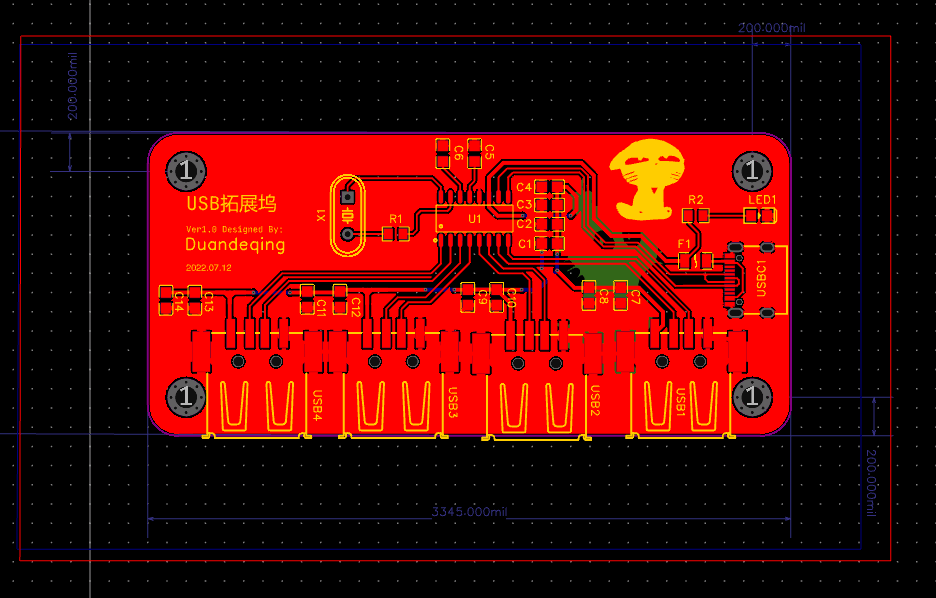
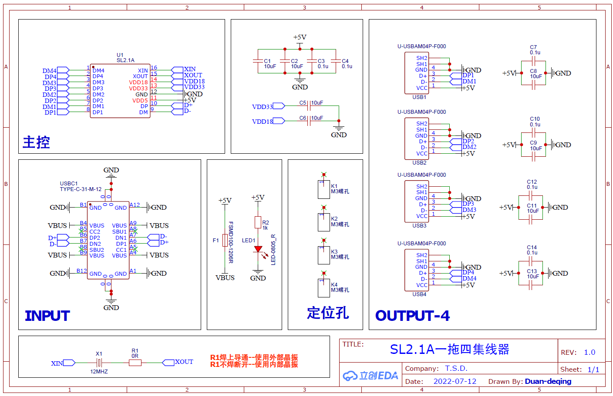
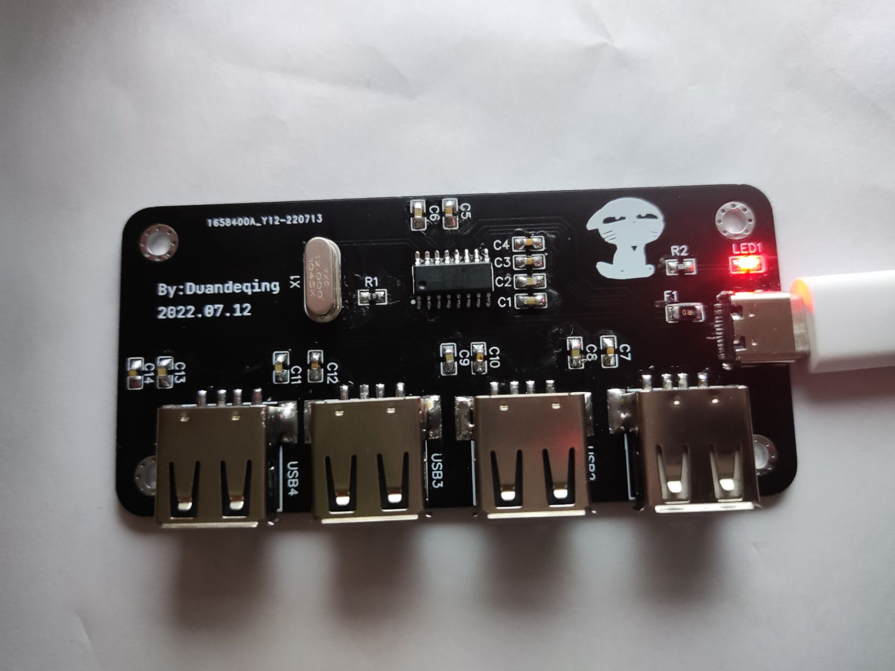

# USB-Hub-v1.0
This is a USB Hub based on SL2.1A IC.
# 基于SL2.0A的USB拓展坞入门

# 1.简介：
低成本的USB拓展坞，USBHub 支持USB2.0 基于芯片SL2.1A。

# 2.描述
USB2.0hub，不支持USB3.0，主要芯片为SL2.1A，已打板验证通过。

接口是Type-C，直接使用数据线连接电脑，Type-C接口可以根据自己需要自行选择数据线长度。

四个TypeA母座是拓展的4个USB接口，可同时供四个设备使用。

# 3.图片

PCB

原理图

实物图

